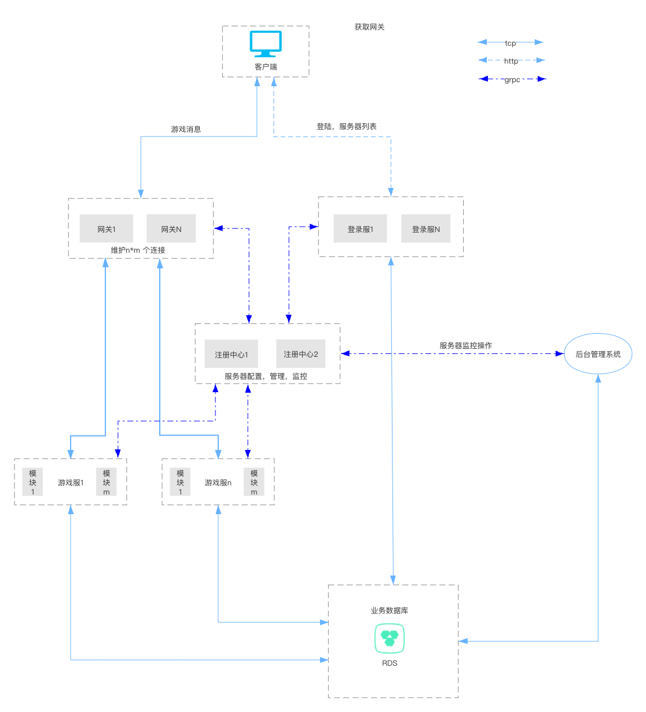

Intro
====
&emsp;&emsp;[GameServer4j](https://github.com/jzyong/GameServer4j) for go version, distributed framework. Clients and gateways use
TCP custom protocols, Intranet message forwarding use GRPC forwarding, all stateless services can be horizontally
extended, and stateful services can be horizontally extended through partition, state binding and other rules. The basic
architecture of the project is shown below:

Module
====

Navmesh pathfinding [server](https://github.com/jzyong/GameAI4j) [client](https://github.com/jzyong/NavMeshDemo)

| Project      | Description                       |
|--------------|-----------------------------------|
| game-api     | login,charge logic                |
| game-common  | common logic,local tool etc       |
| game-gate    | network handle,message dispatcher |
| game-hall    | game logic server                 |
| game-manager | maintain background http services |
| game-message | protobuf message                  |
| game-res     | document,script etc               |
| game-service | game micro service                |
| game-world   | world logic                       |

### TODO
* add document(mdbook)
* develop manager,api,microservice,
* develop redis,mongo
* network optimize,message sequence
* docker-compose run

discuss
---------
* QQ Group：143469012

